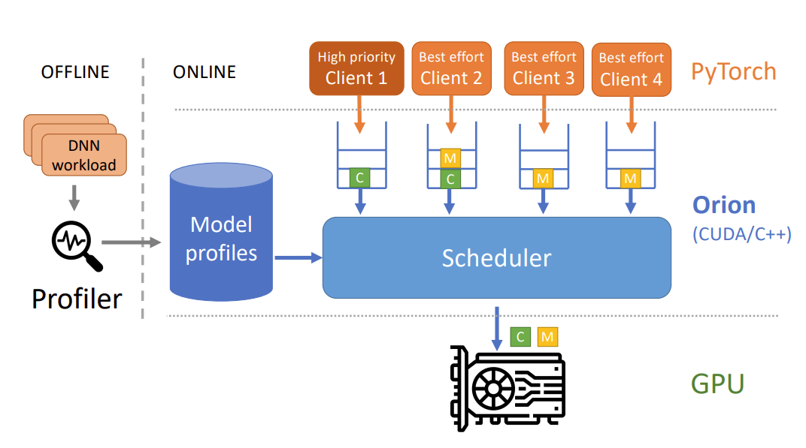

The Orion system is depicted in the following image:

CUDA/CUDNN/CUBLAS calls are intercepted and submitted into software queues managed by the scheduler.
Each submitted workload is profiled before being run, and the resource profiles of each operator are given as inputs to the scheduler. As depicted in the image, Orion currently supports 1 high-prioriy client, and multiple best-effort clients.

### Scheduling Policy

The scheduler polls for new operations from the clients. If an operator from a high-priority client is found, it is submitted directly in the GPU.
If an operator from a best-effort client is found, Orion submits it based on its resource profile, number of SMs it needs, and the duration of on-the-fly best-effort kernels.
